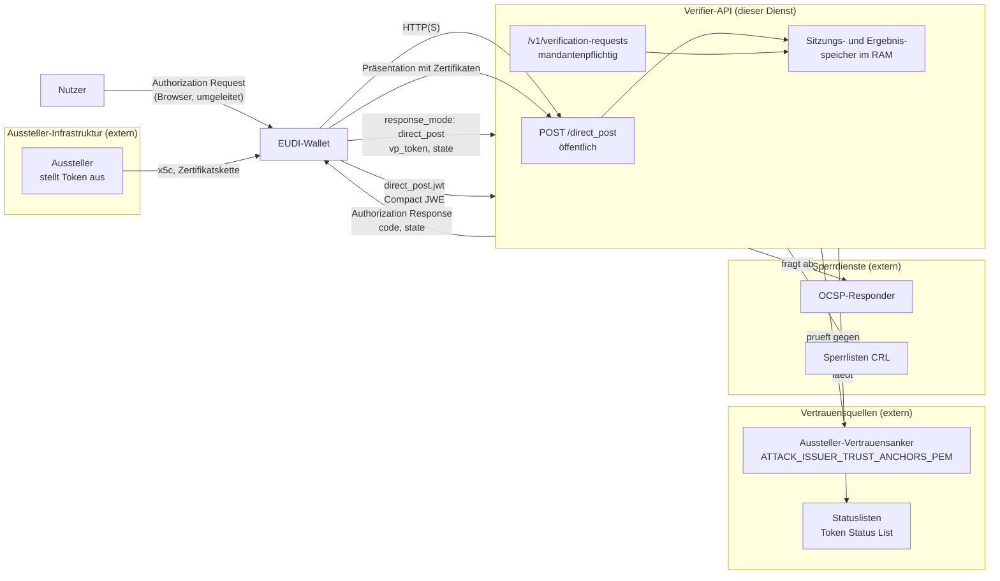

# Bedrohungsmodell

Stand: `main` commit `4040e2d`, 29.09.2026. Jede Aussage in diesem Dokument
verweist auf eine Datei mit Zeilennummer oder auf einen Testnamen. Was nicht
belegbar war, steht als **unbelegt** dabei.

Der Ton ist ein technischer Prüfbericht. Dieses Dokument beschreibt, was der
Code tut — nicht, ob er sicher ist. Es ist **keine** Sicherheitsprüfung; eine
solche hat nicht stattgefunden (`docs/produktionsreife.md:76`).

**Verwendete Abkürzungen:** STRIDE ist die übliche Bezeichnung für die sechs
Bedrohungsklassen Spoofing, Tampering, Repudiation, Information Disclosure,
Denial of Service und Elevation of Privilege. Die Zuordnung unten ist meine
Einordnung, keine Normvorgabe.

## 1. Systemgrenzen und Datenflüsse



**Beleg zu den Grenzen:** Die öffentlichen Routen sind
`/direct_post`, `/v1/verification-requests/:id/request-object`, `/live`,
`/health`, `/ready`, `/metrics`; die mandantenpflichtigen die drei Routen unter
`/v1/verification-requests` mit `access: 'tenant'`
(`src/service/app.ts:186-318`). Mandanten-API-Schlüssel werden nur als SHA-256-Hash
gespeichert, der Klartext nie (`src/service/tenant.ts:27, 51`).

**Nicht im Diagramm, weil es keine Grenze zwischen Instanzen gibt:** Es gibt
kein Shared Storage zwischen mehreren Dienstinstanzen. Sitzungen und Ergebnisse
liegen im RAM des Prozesses (`src/service/service.ts:272-281`).

## 2. Vermögenswerte

| # | Vermögenswert | Wo er liegt | Schutzziel | Beleg |
|---|---|---|---|---|
| W1 | **Verifier privater Schlüssel** | Datei, Pfad aus `ATTACK_VERIFIER_KEY_PEM` | Vertraulichkeit, Integrität | `src/config.ts:28`, `src/service/verifier-identity.ts:105-114` |
| W2 | **Verifier-Zertifikatskette** | Datei, Pfad aus `ATTACK_VERIFIER_CERT_CHAIN_PEM` | Integrität, Gültigkeit | `src/service/verifier-identity.ts:97-103` |
| W3 | **Mandanten-API-Schlüssel** | beim Mandanten; im Dienst nur als SHA-256-Hash | Vertraulichkeit | `src/service/tenant.ts:27, 51` |
| W4 | **Sitzungsstatus** | RAM, Map je Mandant | Vertraulichkeit, Integrität, Einmalnutzung | `src/service/service.ts:272-279`, `src/lib/session.ts:38, 81-82` |
| W5 | **Prüfergebnisse** | RAM, TTL 60 s | Vertraulichkeit, Integrität | `src/config.ts:50`, `src/service/service.ts:281` |
| W6 | **Angefragte Claims** | Teil der Sitzung; Antwort trägt nur diese | Datenminimierung | `src/service/service.ts:527`, `src/service/profile.ts:105` |
| W7 | **Aussteller-Vertrauensanker** | Datei, Pfad aus `ATTACK_ISSUER_TRUST_ANCHORS_PEM` | Integrität, Vertraulichkeit | `src/service/issuer-anchors.ts:23` |

**Zu W5:** Ergebnisse verschwinden nach spätestens 60 Sekunden
(`src/config.ts:50`). Das ist zugleich Schutz gegen Wiederverwendung und eine
Einschränkung für den Betrieb.

## 3. STRIDE-Tabelle

Jede Gegenmaßnahme mit Datei und Zeile, jeder zugehörige Test mit Namen. Wo
kein Test existiert, steht **kein Test vorhanden** — das ist eine Lücke der
Absicherung, keine Behauptung.

| # | STRIDE | Szenario | Gegenmaßnahme | Test | Restrisiko |
|---|---|---|---|---|---|
| S1 | **Tampering** | **Replay** einer bereits eingelösten Wallet-Antwort | Sitzung wird bei Konsum als verbraucht markiert; ein zweiter Versuch liefert `session_reused`. `src/lib/session.ts:19, 81-82`; Rückgabe als `ok: false` in `src/service/service.ts:606-610` | `src/service/erweiterung.test.ts:273` — „loggt presentation_rejected bei Replay (Session bereits verbraucht)“ | **Mittel.** Der Sitzungszustand liegt nur im RAM. Bei mehreren Instanzen hinter einem Lastbalancer ist eine Sitzung nicht an eine Instanz gebunden — **wie das bei mehreren Instanzen tatsächlich wirkt, ist unbelegt**, es gibt keinen Beleg für ein Sticky-Session-Verfahren. |
| S2 | **Spoofing** | **Aussteller nachahmen**: eigene Zertifikatskette in die Präsentation einbauen | Aussteller-Anker werden fail geladen; ohne konfigurierte Anker bricht der Start ab (`src/service/issuer-anchors.ts:65`, `src/service/issuer-anchors.ts:28-46`). Fehlen Anker zur Laufzeit, wird die Präsentation abgelehnt: `issuer_trust_anchors_empty` in `src/service/service.ts:465-466` | `src/service/sicherheitsluecken.test.ts:35` — „Zertifikatsprüfung und Konfiguration nennen denselben Standard“ | **Mittel.** Die Prüfung der Kette selbst stammt aus der Bibliothek `@openeudi/openid4vp` 0.11.1, **nicht** aus diesem Repository. Ein Audit dieser Bibliothek hat nicht stattgefunden (`docs/sicherheit.md:21`). |
| S3 | **Tampering** | **Abgelaufenes oder widerrufenes Zertifikat** einreichen | Zeitliche Gültigkeit der Kette wird beim Start und bei jeder Prüfung geprüft: `assertVerifierChainValid`, `src/service/verifier-identity.ts:58-66` und `src/service/service.ts:537`. OCSP-Sperrung läuft **vor** dem Credential-Status, `src/service/service.ts:544-560` | `src/service/sicherheitsluecken.test.ts:125` — „genau notAfter ist gueltig, eine Sekunde spaeter nicht“; `:130` — „genau notBefore ist gueltig, eine Sekunde vorher nicht“ (Grenzfall an der Sekunde). Kette: `src/onboarding/gueltigkeit.test.ts:231` — `[valid, expired, valid]` ergibt `certificate_expired`. Sperrung: `src/onboarding/ocsp-revocation.test.ts:240` und `:248` | **Gering für die Zeitprüfung.** Die Kette wird an der Grenze geprüft, und `chainValidityFailure` prüft laut Dateikommentar `gueltigkeit.test.ts:147` „die **ganze** Kette (Blatt *und* Anker)“. Für die Sperrung siehe S11. |
| S4 | **Tampering** | **`vp_token` manipulieren** — fremde oder veränderte Angaben einsetzen | Inhaltsprüfung durch die Bibliothek; das Ergebnis trägt **nur die angeforderten** Claims, alles andere wird verworfen: `src/service/service.ts:527` | `src/service/sicherheitsluecken.test.ts:258` — „ein nicht angefragtes Feld faellt raus, egal wie es im Credential stand“; `:284` — „`__proto__` in der Anfrageliste erzeugt kein Feld im Ergebnis“ (Prototype-Verschmutzung); `:269` — „mehrere angefragte Claims kommen vollstaendig durch“. Form: `src/service/praesentations-fuzz.test.ts:113` | **Mittel.** Wie oben: die inhaltliche Prüfung ist Bibliothek, nicht eigener Code. |
| S5 | **Denial of Service** | **Überlange oder missgebildete Eingabe** | Harte Grenzen vor jeder Verarbeitung: `MAX_BODY_BYTES` 64 KiB, `MAX_VP_TOKEN_CHARS` 32 KiB, `MAX_JWE_CHARS` 48 KiB, `MAX_DISCLOSURES` 64, `MAX_STATE_CHARS` 128, `MAX_CLAIMS` 32 — `src/service/limits.ts:18-28` | Jede Grenze ist auf den **exakten Wert** geprüft, Plus eins wird abgelehnt: `src/service/sicherheitsluecken.test.ts:204` (`MAX_VP_TOKEN_CHARS`), `:213` (`MAX_DISCLOSURES`), `:227` (`MAX_STATE_CHARS`), `:244` (`MAX_CLAIMS`). Form statt Inhalt: `src/service/praesentations-fuzz.test.ts:113`; nie ein Wurf: `:98` | **Gering.** Die Grenzen sind an einer Stelle definiert und **jede einzelne** ist auf ihren exakten Randwert geprüft. |
| S6 | **Denial of Service** | **Rate Limit umgehen** | Zwei getrennte Limiter: öffentliche Routen 120 je IP, mandantenpflichtige 60 je API-Schlüssel, Fenster 60 s — `src/config.ts:56-67`. Identität aus API-Schlüssel-Hash, sonst `remoteAddress`: `src/service/app.ts:158-160`. Überschreitung → 429 mit `retry-after`: `src/service/app.ts:162-170` | `src/service/rate-limit.test.ts:10` — „rejects at the limit and resets at the next window“; `:23` — „keeps distributed client identities independent“; `:31` — „protects the public direct_post endpoint and resets the window“ | **Hoch bei öffentlichen Routen.** Die Identität ist dort die IP-Adresse. Hinter einem gemeinsamen Proxy oder Mobilfunk-Gateway teilen sich viele Nutzer dieselbe IP; das Ratenlimit greift dann für alle gemeinsam. **Ob im Betrieb ein Proxy vorgesetzt wird, ist unbelegt** — das hängt an der Infrastruktur des Betreibers. |
| S7 | **Information Disclosure / Elevation** | **Mandantentrennung verletzen**: Mandant A sieht Sitzung oder Ergebnis von Mandant B | Jeder Mandant bekommt einen eigenen Sitzungs- und Ergebnis-Speicher: `src/service/service.ts:272-281`. Mandantenrouten verlangen den API-Schlüssel: `src/service/app.ts:267, 303, 314`. Ein fremder Mandant erhält **404 statt 403**, damit die Existenz der Ressource nicht preisgegeben wird | `src/service/mandanten-matrix.test.ts` — Matrix über **alle** Routen aus `ROUTES`: „ohne Anmeldung → 401“, „falscher Schlüssel → 401“, „fremder Mandant → 404, ununterscheidbar von ‚nie vorhanden'“ (Dateikopf Zeilen 1-10). Öffentliche Routen müssen ausdrücklich freigegeben sein, eine neue Route ohne Eintrag fällt auf (`:92`) | **Gering.** Die Trennung ist nicht nur über die Speicherstruktur belegt, sondern über eine Matrix geprüft, die jede Mandantenroute abdeckt und bei einer neuen Route ohne Eintrag auffällt. |
| S8 | **Information Disclosure** | **Leck in der Antwort** — mehr Daten als angefordert | Antwort trägt nur angeforderte Claims: `src/service/service.ts:527`. Fehlercodes sind feste/documentationierte Zeichenketten statt Rohmeldungen: `src/service/limits.ts:82-90` | `src/service/praesentation-422-e2e.test.ts`, `src/service/fehlerbilder.test.ts:254-260` (`assertCleanError` prüft `DOCUMENTED` und verbotene Inhalte) | **Gering.** |
| S9 | **Information Disclosure** | **Leck auf der Konsole** — die Prüfbibliothek schreibt eigene Warnungen | Zustandsloser Präfixfilter für die Ausgaben der Bibliothek: `src/lib/library-log-filter.ts:72`, installiert in `src/service/run.ts:25`. Der Filter wirkt **nur** auf `console.warn` und **nur**, wenn das erste Argument mit dem Präfix `[openid4vp]` beginnt | **Kein automatisierter Test vorhanden** — das sagt `docs/pruefmittel-ocsp-logfilter.sh` wörtlich in seinem Kopf: „Es gibt dafür keinen Test — deshalb dieses Werkzeug.“ Es gibt zusätzlich `src/lib/library-log-filter.test.ts` für den Filter selbst | **Mittel, und die Schwachstelle ist im Projekt bekannt.** Ändert ein Update der Bibliothek Präfix oder Kanal, wird der Filter **stillschweigend unwirksam** und Zertifikatsdaten landen wieder im Prozesslog (`docs/pruefmittel-ocsp-logfilter.sh:2-7`). Das Skript ist ausdrücklich als manuell nach jedem Update auszuführen vorgesehen — es ist **kein** CI-Job. Ob es nach dem letzten Update gelaufen ist, ist **unbelegt**. → Abschnitt 5, M1 |
| S10 | **Information Disclosure** | **Leck im Audit-Log** | Das Audit-Log enthält keine personenbezogenen Angaben (`docs/produktionsreife.md:52`); Einträge tragen Mandant, Ereignis und Grund, `src/service/audit.ts:32-35` | `src/service/erweiterung.test.ts:273` prüft das Audit-Ereignis beim Replay | **Mittel.** Das Log liegt im **RAM** des Prozesses. Es ist damit nicht persistent — das schützt Daten, bedeutet aber auch, dass es bei einem Neustart verloren ist. **Ob das für den Nachweiszweck des Betreibers genügt, ist unbelegt.** |
| S11 | **Denial of Service / Tampering** | **Ausfall der Sperrprüfung** — OCSP-Responder nicht erreichbar | Bounded soft fail: eine zuvor erfolgreich geprüfte Antwort darf höchstens 24 Stunden über ihr `nextUpdate` hinaus weiterverwendet werden. `src/onboarding/ocsp-revocation.ts:122`; Cache-Obergrenze ebenfalls 24 h, `:117` | `src/onboarding/ocsp-revocation.test.ts:575` — eigener Testblock „OCSP-Client: Option B — drei Zustaende und **Grenzfall 24 h**“, mit der Konstante `FRIST_24H` in `:576` und einem simulierten 503-Ausfall (`:578-590`) | **Bewusst und dokumentiert, dennoch das größte verbleibende Risiko.** Bis zu 24 Stunden kann ein **nachträglich gesperrtes** Zertifikat noch akzeptiert werden. Begründung in `docs/entscheidung-ocsp-fail-modus.md:90`. Die Frist ist eine Konstante, **keine Umgebungsvariable**. Ob die Spezifikation dafür eine Zahl vorgibt, ist in `docs/entscheidung-gnadenfrist.md` als offene Frage geführt. |
| S12 | **Elevation of Privilege** | **Testschlüssel-Code im Produktionsimage** nutzen, um eine echte Identität vorzutäuschen | Beide Dateien sind bewusst enthalten und im Dockerfile begründet: `Dockerfile:43-52`, `Dockerfile:72` und `:92`. Der Rückfallpfad hängt am Entwicklungsschalter `ATTACK_DEV_MODE`, der in Produktion gesperrt ist (`src/config.ts:121-126`); der Bootstrap meldet über `usedTestIdentity` und `usedTestAnchor`, ob Testmaterial verwendet wurde | `src/service/produktionsschalter.test.ts:107-108` — über eine Kombinationsmatrix: `assert.equal(boot.usedTestIdentity, !c.keys)` und `assert.equal(boot.usedTestAnchor, !c.keys, 'TEST-Anker nur ohne konfigurierte Anker (und nur mit Entwicklungsschalter)')` | **Mittel.** Der Pfad ist an den gesperrten Entwicklungsschalter gebunden, und die Matrix prüft, dass Testanker **nur** ohne konfigurierte Anker und **nur** mit Entwicklungsschalter gesetzt werden. Offen bleibt: der Fall „Produktion, keine echte Identität, kein Schalter“ führt zum Startabbruch, **statt** Testmaterial zu erzeugen — das ist durch `produktionsschalter.test.ts:188` („Produktion ohne echte Identität -> Exit 1“) belegt. **Unbelegt bleibt**, ob `mock-wallet.ts` im Produktionsimage auch dann erreichbar ist, wenn ein Angreifer den Schalter selbst setzen kann — dafür gibt es keinen Test. |
| S13 | **Elevation of Privilege** | **Entwicklungsschalter in Produktion** missbrauchen | Drei Regeln, alle mit Startabbruch: `NODE_ENV=production` mit `ATTACK_DEV_MODE=true` → Abbruch (`src/config.ts:121-126`); `ATTACK_ALLOW_SELF_SIGNED=true` in Produktion → Abbruch (`src/config.ts:128-134`); selbstsigniert ohne Entwicklungsschalter → Abbruch (`src/config.ts:138-143`) | `src/service/produktionsschalter.test.ts:191` — „Produktion mit Entwicklungsschalter -> Exit 1“; `:194` — „Produktion mit selbstsigniert -> Exit 1“ | **Gering für die Schalter selbst.** **Aber:** die Sicherung hängt an `NODE_ENV`, also an einer **Umgebungsvariable des Betreibers**. Setzt der Betreiber sie falsch, greift keine der drei Regeln. Ob zusätzlich eine organisatorische Kontrolle existiert, ist **unbelegt**. |
| S14 | **Elevation of Privilege** | **Aussteller-Anker fehlen** und der Dienst läuft trotzdem | Start bricht ab: `src/service/issuer-anchors.ts:28, 32, 38`; fehlen sie zur Laufzeit, wird die Präsentation abgelehnt statt angenommen (`src/service/service.ts:465-466`) | `src/service/produktionsschalter.test.ts:188` — „Produktion ohne echte Identität -> Exit 1, klare Meldung“. Laufzeitfall: `src/service/aussteller-anker.test.ts:212` — „leere Liste -> abgelehnt (issuer_trust_anchors_empty), **Sitzung nicht verbraucht**“; `:229` prüft, dass die Anker **nur** mit Onboarding-Material genutzt werden | **Gering.** Beide Fälle — fehlend beim Start und leer zur Laufzeit — sind geprüft. Der zweite Test prüft zusätzlich, dass eine abgelehnte Sitzung **nicht** verbraucht wird. |
| S15 | **Repudiation** | Ein Prüfergebnis soll später bestritten werden | Audit-Ereignisse für angenommene und abgelehnte Fälle, `src/service/audit.ts:35`. Zwei getrennte Ereignisnamen: `presentation_rejected` (422) und `presentation_invalid` (200), `src/service/service.ts:592, 539` | `src/service/erweiterung.test.ts:273` | **Hoch für einen Nachweiszweck.** Das Log ist flüchtig (siehe S10) und es gibt **keine** kryptographische Verkettung oder Signierung der Einträge. Damit ist ein Audit gegenüber Dritten nicht belastbar. Das ist eine **Eigenschaft des Entwurfs**, kein Versehen — aber es bedeutet, das Protokoll trägt keine Beweislast. |
| S16 | **Information Disclosure** | **Sitzungs- und Ergebniszustand im Klartext im RAM** eines dumps | Keine besondere Behandlung. Ergebnisse tragen nur angeforderte Claims (`src/service/service.ts:527`), Sitzungen nur Zustandsangaben | **Kein Test vorhanden.** | **Unbelegt.** Ob ein Speicherabzug des Prozesses als Angriff gilt, ist eine Bedrohungsannahme, die der Betreiber beantworten muss. Im Repository gibt es dafür **keinen** Schutz und **keine** Aussage. → Abschnitt 5, M2 |

### Zu den Grenzen der Tabelle

Die Zuordnung einzelner Szenarien zu STRIDE-Klassen ist meine Einordnung. Wo
ich „Mittel“ oder „Hoch“ schreibe, ist das eine Einschätzung ohne hinterlegte
Risikomatrix — **die Schweregrade sind nicht normativ abgeleitet.** Für eine
Bewertung müssten sie gegen die Bedrohungslage des Betreibers gewichtet werden.

## 4. Nicht abgedeckt

Dieser Abschnitt ist Abgrenzung. Er nennt, was dieses Dokument **nicht**
behandelt, und warum das keine Lücke der Software ist, sondern eine Grenze des
Modells.

- **Kundeninfrastruktur.** Ob die Wallet-Applikation selbst sicher ist, ob der
  Umleitungs-Mechanismus des Betreibers die Autorisierungsanfrage verändert,
  ob TLS-Zertifikate in der Auslieferung geprüft werden: **nicht Gegenstand
  dieses Dienstes und in diesem Repository nicht beurteilt.**
- **Wallet-Sicherheit.** Ob die Wallet Schlüssel sicher verwahrt, ob eine
  Präsentation vor der Übertragung manipuliert wurde, ob der Nutzer die
  richtige Wallet verwendet: **unbelegt und hier nicht bewertbar.** Der Dienst
  sieht nur das Ergebnis der Wallet-Interaktion.
- **Netzwerkschicht.** TLS-Terminierung, Firewalls, Segmentierung und
  DDoS-Schutz liegen außerhalb des Prozesses. `docs/deployment.md:87` weist die
  TLS-Verantwortung ausdrücklich einem **Reverse Proxy** zu, „der TLS besitzt und
  damit auch die transporbezogene Sicherheit"; der Dienst selbst setzt keine TLS
  voraus, und `docs/deployment.md:96` mahnt, TLS nicht innerhalb der Anwendung
  zu konfigurieren. **Ob der Betreiber einen solchen Proxy betreibt, ist
  unbelegt** — es gibt im Repository keinen Nachweis dafür.
- **Kein Penetrationstest.** Es hat keiner stattgefunden.
  `docs/produktionsreife.md:76` führt „Externes Security-Review" als nicht
  erfüllt; `docs/sicherheit.md:21` sagt es wörtlich.
- **Keine externe Prüfung** dieser Codebasis und **kein** Audit der
  Prüfbibliothek `@openeudi/openid4vp` (ebenda).
- **Keine Zertifizierung und keine Konformitätserklärung.** Die Profile sind an
  den ARF- und eIDAS-2.0-Spezifikationen orientiert; ein offizieller
  Konformitätsnachweis liegt nicht vor (`docs/eidas-arf-konformitaet.md:37`:
  „Nicht erfüllt/nicht nachgewiesen").
- **Mandantenverwaltung.** Wer Mandanten anlegt, Schlüssel verteilt und wieder
  entzieht, ist eine Betriebsaufgabe. Im Repository existiert ein
  Admin-CLI (`src/cli/main.ts`), aber **kein** Rechtekonzept, das beschreibt,
  wer es benutzen darf. Das ist eine Lücke des Betriebs, nicht des Codes.
- **Onboarding-Gate.** Im strengen Produktionsbetrieb meldet `/ready`
  `onboarding: failed`, solange kein Gate-Material vorliegt
  (`src/service/run.ts:47`). Das Verhalten ist dokumentiert, die
  Gate-Logik selbst **nicht** Teil dieses Modells (`docs/entscheidung-gnadenfrist.md`).
- **Nicht betrachtet:** die 24-Stunden-Gnadenfrist für die **Gate**-Kette (B4)
  — dafür fehlen bis heute acht Antworten auf Fragen zu den echten
  Zertifikatsprofilen (`docs/entscheidung-gnadenfrist.md` Abschnitt 6).

## 5. Nicht gefundene Gegenmaßnahmen

Dieser Abschnitt listet auf, wo eine Gegenmaßnahme, die als vorhanden erscheint,
**nicht maschinell abgesichert** ist. Jeder Punkt ist mit einer ausgeführten
Suche belegt, nicht behauptet.

### M1 — Der Log-Filter ist nach einem Bibliotheksupdate ungeprüft (Bezug: S9)

Der Filter unterdrückt Ausgaben der Prüfbibliothek nur, wenn das erste Argument
mit dem Präfix `[openid4vp]` beginnt und der Kanal `console.warn` ist
(`src/lib/library-log-filter.ts:72`). Ändert ein Update der Bibliothek Präfix
oder Kanal, wird der Filter **stillschweigend unwirksam** und Zertifikatsdaten
landen wieder im Prozesslog.

**Es gibt dafür keinen automatisierten Test, und es gibt keinen CI-Job, der das
prüft.** Belege:

```text
$ grep -niE "log-filter|logfilter|filter" .github/workflows/*.yml
  (keine Ausgabe)

$ grep -cE "^    name: " .github/workflows/ci.yml
  12

$ git grep -n "pruefmittel-ocsp-logfilter" -- .
  docs/pruefmittel-ocsp-logfilter.sh:11
  docs/sicherheit.md:211
  docs/sicherheit.md:296
  docs/gesamtstatus-2026-09-25.md:96   (und weitere)
```

Alle Treffer außer dem Skript selbst sind **Dokumentationsverweise** — im
Workflow wird das Skript nirgends aufgerufen. Das Projekt weiß das selbst;
`docs/pruefmittel-ocsp-logfilter.sh:6-7` sagt wörtlich:

> „Es gibt dafür keinen Test — deshalb dieses Werkzeug.“

und `docs/gesamtstatus-2026-09-25.md:96` führt die Gegenmaßnahme als
„**intern, überwacht**“ mit dem Zusatz „**Kein Test bricht darauf**“.

**Was fehlt:** ein Test, der das Präfix gegen die installierte Bibliothek prüft,
und die Einbindung des vorhandenen Skripts in die CI. Der CI-Job `Dependency
audit` (`ci.yml:242`) und der Drift-Wächter des SDK prüfen die
Versionsnummer, nicht das Ausgabeverhalten.

**Ob das Skript nach dem letzten Bibliotheksupdate gelaufen ist, ist unbelegt.**

### M2 — Speicherabzüge des Prozesses: weder Schutz noch Aussage (Bezug: S16)

Sitzungen und Ergebnisse liegen im RAM des Prozesses
(`src/service/service.ts:272-281`). Ob ein Speicherabzug als Angriff gilt, ist
eine Bedrohungsannahme, die der Betreiber beantworten muss.

```text
$ git grep -inE "core dump|speicherabzug|memdump|core_pattern|process\.memoryUsage" -- src/ docs/
  (keine Ausgabe außerhalb dieses Dokuments und des zugehörigen Berichts)
```

**Es gibt im Repository keinen Schutz**, keine Konfiguration gegen
Kerneldumps und **keine Aussage**, ob das eine übertragene Bedrohung ist. Der
Dienst läuft als gewöhnlicher Node-Prozess; ein Speicherabzug erfordert
Zugriff auf das Dateisystem oder den Container, also eine Berechtigung, die
außerhalb dieses Dienstes vergeben wird.

**Wie hier behandelt, ist unbelegt** — es gibt keine Betriebsentscheidung dazu,
auf die ich mich berufen könnte.

### M3 — Weitere Zeilen ohne maschinellen Beleg, geprüft

| Zeile | Geprüft mit | Ergebnis |
|---|---|---|
| S1 Replay | `grep -rn session_reused --include="*.test.ts" src/` | **10 Fundstellen.** Abgesichert. |
| S6 Ratenlimit | `src/service/rate-limit.test.ts:10, 23, 31` | Abgesichert, inkl. Verteilung über Instanzen. |
| S7 Mandantentrennung | `src/service/mandanten-matrix.test.ts` | Abgesichert, Routenmatrix. |
| S8 Antwort-Leck | `src/service/fehlerbilder.test.ts:34, 259` — `DOCUMENTED` wird aus `docs/fehlercodes.md` **gelesen**, jeder Code muss dort stehen | Abgesichert, inkl. Abgleich mit der Doku. |
| S10 Audit | 23 Fundstellen für die Ereignisnamen; zusätzlich `src/service/audit-inhalt.test.ts` für den **Inhalt** | Abgesichert. Zum Inhalt siehe M4. |
| S11 Sperrfrist | `ocsp-revocation.test.ts:575-576` | Abgesichert, Grenzfall 24 h. |
| S12 Testschlüssel | `produktionsschalter.test.ts:107-108, 188` | Abgesichert für die Schalterlogik. |
| S13 Dev-Modus | `produktionsschalter.test.ts:191, 194` | Abgesichert für die Konfiguration. |
| S15 Repudiation | 23 Fundstellen für die Audit-Ereignisse; `src/service/audit.ts` für die Verkettung, `src/service/audit-verkettung.test.ts` für die Prüfung | **Hash-verkettet, aber weiterhin keine Beweislast.** Jeder Eintrag trägt einen SHA-256 über den Hash des Vorgängers und den eigenen Inhalt, `verifyChain` meldet die erste Abweichung mit Index. Siehe M4. |

### M4 — Audit-Log-Inhalt: Stand nach diesem Paket

**Ursprünglicher Befund:** Es gab Tests, die prüften, **ob** ein Ereignis
geschrieben wird, aber keinen, der prüfte, **was** darin steht. Die Aussage
„ohne PII“ in `docs/produktionsreife.md` war nicht automatisiert abgesichert.

**Abhilfe:** `src/service/audit-inhalt.test.ts` legt den Markerwert
`MARKER-PII-4c2e91` als Claim-Wert in die Präsentation und prüft, dass er in
**keinem** serialisierten Audit-Eintrag auftaucht. Sechs Fälle, jeder mit einer
Gegenprobe, die sicherstellt, dass der Pfad überhaupt Einträge erzeugt:

| Fall | Geprüft |
|---|---|
| gültige Präsentation | `presentation_valid` entsteht, Marker fehlt |
| nicht angefragter Claim | zusätzlich ein weiterer, fremder Claim |
| inhaltlich abgelehnt, nicht vertrauter Aussteller | `presentation_invalid` entsteht, Marker fehlt |
| Replay | `session_reused`, `presentation_rejected` entsteht, Marker fehlt |
| unbekannter Zustand | `unknown_state`, Marker fehlt |
| **freier Text als clientgelieferter Zustandswert** | der `state` kommt aus dem Request-Body und wird nur auf Länge geprüft (`src/service/app.ts:249`, `src/service/limits.ts:58`) — der Fall prüft, dass er nicht ungefiltert ins Log wandert |

**Was damit abgedeckt ist:** kein Inhalt der Präsentation im Log, über alle
Ereignisarten hinweg, die eine Präsentation erzeugt.

**Was weiterhin nicht abgedeckt ist:**

1. **Mandanten-ID und Sitzungskennung landen absichtlich im Log**
   (`src/service/service.ts:446, 584`). Das sind pseudonyme Kennungen. Ob sie den
   Anforderungen eines Datenschutzkonzepts genügen, ist eine Bewertungsfrage des
   Betreibers und hier **nicht** belegt.
2. **Ein Eintrag hat genau vier Felder** — Zeitstempel, Mandant, Ereignis,
   `detail` (`src/service/audit.ts:25-30`). Ob über die Zeit *alle* Ereignisse
   eines Betriebszeitraums nachvollziehbar sind, ist nicht getestet.
3. **Das Audit-Log trägt weiterhin keine Beweislast** (siehe S15). Es ist jetzt
   hash-verkettet, das ändert die Lage nur teilweise. Das ist kein Testproblem,
   sondern eine Eigenschaft des Entwurfs. Vier Grenzen bleiben:

   a. **Nachträglich, nicht verhindernd.** Die Verkettung erkennt eine
      Manipulation, wenn sie später auffällt. Sie verhindert sie nicht.
   b. **Wer den Prozess kontrolliert, kann alles neu rechnen.** Der Startwert der
      Kette liegt im selben Prozess. Wer den Speicher beschreiben kann, kann die
      Kette von vorn aufbauen. Ohne äußere Verankerung ist der Hash nur ein
      innerer Konsistenznachweis.
   c. **Das Log bleibt flüchtig.** Es liegt im Arbeitsspeicher, ein Neustart
      löscht es. Damit fehlt die Beweiskette genauso wie das Log selbst.
   d. **Ohne äußere Verankerung keine Beweislast vor Dritten.** Nötig wären eine
      Signatur, ein Zeitstempel eines unabhängigen Dienstes oder externer
      Speicher. Keines davon ist vorhanden.

## 6. Nicht modelliert

Hier steht bewusst nichts. Die ursprüngliche Anweisung für diesen Abschnitt war
unvollständig abgeschnitten; ich setze sie nicht durch Raten fort. Falls dort
etwa eine Risikomatrix, ein Angriffsbaum, eine Bedrohungsakteur-Abschätzung oder
eine Abnahme-Checkliste gemeint war: das braucht eine Vorgabe, nicht meine
Annahme — die Gewichtung der Schweregrade in Abschnitt 3 hängt zum Beispiel
davon ab, welcher Angreifer als Maßstab gilt.
